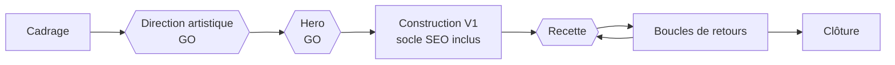

# Catalyst Skills

Un système de production de sites premium piloté par agent, construit comme un ensemble de skills [Claude Code](https://claude.com/claude-code).

Dix skills mènent une mission du premier brief à la livraison mesurée : cadrage, direction artistique, socle SEO, vidéo pilotée au scroll, capture de leads, e-commerce, clôture. L'agent exécute. Un humain tranche à chaque étape qui compte.

[English version](README.md)

## Résultats

Mesurés sur des missions réelles entre juillet et septembre 2026. Les clients sont anonymisés. Méthode et tableaux complets (en anglais) : [docs/case-studies.md](docs/case-studies.md).

| Quoi | Résultat |
|---|---|
| Audit SEO tiers, joaillier | 83 à 93 sur 100 |
| Audit SEO tiers, première soumission, deux projets | 95 sur 100, sans version corrective |
| Lighthouse mobile, agence immobilière, 5 passes | 99 au mieux, 96 en médiane, puis 100 / 100 / 100 |
| Total Blocking Time, cabinet d'avocat | 860 ms à 40 ms |
| Hero au scroll, première image animée sur ordinateur | 39,4 s à 1,9 s |
| Hero au scroll, images présentées sur 10 s de défilement | 181 à 594 |

Chaque projet mesuré atteint 90 ou plus en performance mobile Lighthouse, au meilleur de 3 à 5 passes. Les médianes sont publiées à côté des meilleures passes.

## Le pipeline



Les hexagones sont les validations humaines. Détail : [docs/pipeline.md](docs/pipeline.md).

## Les skills

| Skill | Commande | Fonction |
|---|---|---|
| [website-production](docs/skills/website-production.md) | `/website-production` | Cadrage par lots de questions, récapitulatif modifiable, fichier d'état validé, routage vers les autres skills |
| [da-moderne](docs/skills/da-moderne.md) | par son nom | Méthode de direction artistique : 4 modes, 3 variantes, budgets chiffrés, 7 sites de référence audités |
| [seo-garantie-90](docs/skills/seo-garantie-90.md) | par son nom | Socle SEO, confiance et lisibilité par les IA, appliqué dès la première version |
| [scroll-frames-3d](docs/skills/scroll-frames-3d.md) | par son nom | Hero vidéo piloté au scroll : génération, encodage, lecteur, mobile, recette |
| [popup-conversion](docs/skills/popup-conversion.md) | `/popup-conversion` | Décide si un popup est pertinent, puis le spécifie. Aucun dark pattern |
| [plinko-popup](docs/skills/plinko-popup.md) | par son nom | Jeu de capture à boule qui tombe, lots signés par le serveur |
| [shopify-ecommerce-build](docs/skills/shopify-ecommerce-build.md) | par son nom | Boutique Next.js headless reliée à Shopify |
| [mission-template](docs/skills/mission-template.md) | par son nom | Brief en sept parties d'une mission autonome, après le GO de direction artistique |
| [project-resume](docs/skills/project-resume.md) | `/project-resume` | Reprise d'un projet après remise à zéro du contexte, en lecture seule par défaut |
| [production-finish](docs/skills/production-finish.md) | `/production-finish` | Validations bloquantes de clôture, rapport, promotion validée des leçons |

Les skills sont écrits en français. Chaque skill a sa fiche en anglais dans `docs/skills/`.

## Autonomie

Choisie au cadrage, enregistrée dans le fichier d'état. Détail : [docs/autonomy-modes.md](docs/autonomy-modes.md).

| Mode | L'agent s'arrête |
|---|---|
| Guidé | À chaque étape |
| Checkpoints clés | À la direction artistique, au hero et à la recette |
| Autonome après le GO de direction artistique | À la direction artistique seulement, puis va au bout |
| `break_the_rules` | Un régime de règles, combinable avec les modes ci-dessus. Lève des défauts de design nommés, jamais les invariants |

La direction artistique n'est jamais autonome. Sécurité, légalité, chemin ambigu et action hors du projet restent bloquants dans tous les modes.

## Choix d'ingénierie

- **L'état vit dans un fichier.** Un fichier YAML validé porte l'état de la mission : une session peut être vidée puis reprise au bon checkpoint.
- **Fermé par défaut.** La clôture refuse de marquer une mission terminée tant qu'une validation bloquante reste ouverte.
- **Apprentissage contrôlé.** L'agent ne réécrit jamais ses propres instructions. Une leçon reste candidate jusqu'à son approbation, diff exact à l'appui.
- **Mesure qui tient compte du bruit.** Lighthouse est lancé en plusieurs passes sur l'URL publique, et le meilleur score comme la médiane sont consignés.
- **Lots signés par le serveur.** Dans les jeux de capture, le lot est décidé et signé côté serveur. Le navigateur anime un résultat, il ne le choisit pas.
- **Aucun fait inventé.** Une note, un chiffre ou une citation ne s'affiche que s'il a été vérifié à la source.

## Comment ce dépôt est publié

Les skills en production contiennent des noms de clients, des identifiants internes et des chemins serveur. Ce dépôt en est une copie expurgée, produite par un processus dédié.

1. Chaque skill est réécrit avec une table d'anonymisation privée : un client, un libellé générique, partout.
2. Un relecteur indépendant compare la copie à l'original et cherche ce qui identifierait un client.
3. [tools/leak-scan.py](tools/leak-scan.py) bloque la publication au moindre email, téléphone, chemin serveur, URL de déploiement, identifiant de fichier, secret ou terme d'une liste privée.
4. La couche générique du scanner tourne à nouveau à chaque push, en intégration continue.

Une partie n'est volontairement pas publiée : la grille de notation de l'outil d'audit tiers, reconstituée à partir de sa méthodologie publique et d'audits mesurés. La méthode et les scores sont ici. La grille reste privée.

## Installer un skill

```bash
git clone https://github.com/sam-halimi/catalyst-skills.git
cp -r catalyst-skills/skills/da-moderne ~/.claude/skills/
```

## Licence

Skills et documentation : CC BY-NC 4.0. Code : MIT. Voir [LICENSE.md](LICENSE.md).

## Auteur

Samuel Halimi, fondateur de Catalyst, studio de sites premium pour commerces et entreprises indépendantes.
