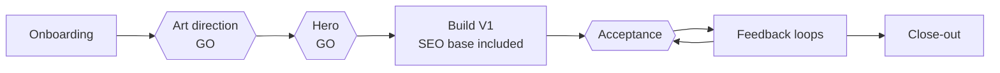

# Catalyst Skills

An agentic production system for premium websites, built as a set of [Claude Code](https://claude.com/claude-code) skills.

Ten skills take a mission from the first brief to a measured delivery: onboarding, art direction, SEO base, scroll-driven video, lead capture, e-commerce, close-out. The agent does the work. A human decides at every gate that matters.

[Version française](README.fr.md)

## Results

Measured on real missions between July and September 2026. Clients are anonymised. Method and full tables: [docs/case-studies.md](docs/case-studies.md).

| What | Result |
|---|---|
| Third-party SEO audit, jeweller | 83 to 93 out of 100 |
| Third-party SEO audit, first submission, two projects | 95 out of 100, no corrective version |
| Lighthouse mobile, estate agency, 5 runs | 99 best, 96 median, then 100 / 100 / 100 |
| Total Blocking Time, law practice | 860 ms to 40 ms |
| Scroll hero, first animated frame on desktop | 39.4 s to 1.9 s |
| Scroll hero, frames presented over a 10 s scroll | 181 to 594 |

Every measured project reached 90 or more on Lighthouse mobile performance, taking the best of 3 to 5 runs. Medians are published next to the best runs.

## The pipeline



Hexagons are human gates. Details: [docs/pipeline.md](docs/pipeline.md).

## The skills

| Skill | Command | What it does |
|---|---|---|
| [website-production](docs/skills/website-production.md) | `/website-production` | Onboarding by batches of questions, editable recap, validated state file, routing to the other skills |
| [da-moderne](docs/skills/da-moderne.md) | by name | Art direction method: 4 modes, 3 variants, numeric budgets, 7 audited reference sites |
| [seo-garantie-90](docs/skills/seo-garantie-90.md) | by name | SEO, trust and AI readiness base applied in the first version |
| [scroll-frames-3d](docs/skills/scroll-frames-3d.md) | by name | Scroll-driven video hero: generation, encoding, player, mobile, acceptance |
| [popup-conversion](docs/skills/popup-conversion.md) | `/popup-conversion` | Decides whether a popup is relevant, then specifies it. Dark patterns banned |
| [plinko-popup](docs/skills/plinko-popup.md) | by name | Falling-ball capture game with server-signed prizes |
| [shopify-ecommerce-build](docs/skills/shopify-ecommerce-build.md) | by name | Headless Next.js storefront connected to Shopify |
| [mission-template](docs/skills/mission-template.md) | by name | Seven-part brief for an autonomous mission, after the art-direction GO |
| [project-resume](docs/skills/project-resume.md) | `/project-resume` | Resumes a project after a context reset, read-only by default |
| [production-finish](docs/skills/production-finish.md) | `/production-finish` | Blocking close-out gates, report, validated promotion of lessons |

The skills are written in French, the working language of the agency. Each one has an English card in `docs/skills/`.

## Autonomy

Chosen at onboarding, stored in the state file. Details: [docs/autonomy-modes.md](docs/autonomy-modes.md).

| Mode | The agent stops |
|---|---|
| Guided | At every step |
| Key checkpoints | At art direction, hero and acceptance |
| Autonomous after the art-direction GO | At art direction only, then runs to the end |
| `break_the_rules` | A rules regime, combined with any mode above. Lifts named design defaults, never the invariants |

Art direction is never autonomous. Security, legality, ambiguous paths and actions outside the project stay blocking in every mode.

## Engineering choices

- **State lives in a file.** A validated YAML file holds the mission state, so a session can be cleared and resumed at the right checkpoint.
- **Fail closed.** Close-out refuses to mark a mission done while a blocking gate is open.
- **Controlled learning.** The agent never rewrites its own instructions. Lessons are candidates until each one is approved with its exact diff.
- **Noise-aware measurement.** Lighthouse is run best-of-N on the public URL, and the best and the median are both recorded.
- **Server-signed rewards.** In capture games the prize is decided and signed on the server. The browser animates an outcome, it never chooses one.
- **No invented fact.** A rating, a figure or a quote is displayed only if it was verified at the source.

## How this repository is published

The skills in production contain client names, internal identifiers and server paths. This repository is a redacted copy, produced by a process of its own.

1. Each skill is rewritten with a private anonymisation table: one client, one generic label, everywhere.
2. An independent reviewer compares the copy with the original and looks for what would identify a client.
3. [tools/leak-scan.py](tools/leak-scan.py) blocks the publication on any email, phone number, server path, deployment URL, cloud file identifier, credential, or term of a private denylist.
4. The generic layer of the scanner runs again on every push, in continuous integration.

One part is deliberately not published: the scoring grid of the third-party audit tool, reverse-engineered from its public methodology and from measured audits. The method and the scores are here. The grid stays private.

## Install a skill

```bash
git clone https://github.com/sam-halimi/catalyst-skills.git
cp -r catalyst-skills/skills/da-moderne ~/.claude/skills/
```

The skill is then available in Claude Code under its name.

## Repository layout

```
skills/        the ten skills, redacted, in French
docs/          pipeline, autonomy modes, measured results
docs/skills/   one English card per skill
tools/         leak scanner
licenses/      license texts
```

## License

Skills and documentation: CC BY-NC 4.0. Code: MIT. See [LICENSE.md](LICENSE.md).

## Author

Samuel Halimi, founder of Catalyst, a studio building premium websites for independent businesses.
