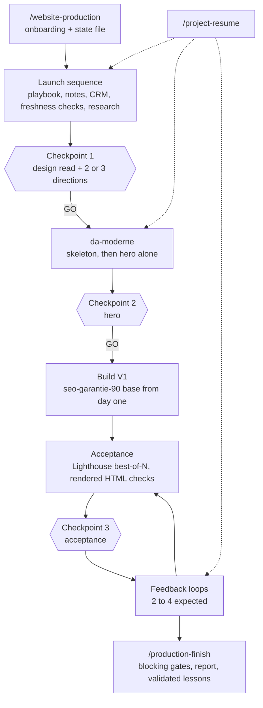

# The production pipeline

A website mission runs through a launch sequence, then six phases. Each phase has a gate. The agent stops at a gate and waits for a decision.

## Launch sequence

Seven steps, in a fixed order, each announced before it runs.

1. Read the production playbook in full.
2. Re-read the working notes: palettes and typefaces already used, deployment flow, measurement caveats.
3. Read the prospect's row in the CRM.
4. Check that the data is still true: is the business independent or part of a group, is its current site really in the state recorded, what does its map listing say today.
5. Research: scrape the prospect's own texts, prices and photos, find press and directory mentions, geocode the address.
6. Load the skills in order: art direction, then the SEO base, then the scroll hero only if the story carries a travelling shot.
7. **Stop at checkpoint 1.** Present the design read and two or three art directions with a recommendation.

Before the GO on art direction, no application code, component, final asset, build or deployment is allowed. Only steering and research files may be written.

## The six phases

| Phase | What happens | Gate |
|---|---|---|
| 0. Target | CRM row, independence check, current site state | Independence confirmed before any demo |
| 1. Real material | Scrape the existing site and listings, verify the map listing, find press | No invented fact. "To be completed" where data is missing |
| 2. Art direction | Design read, mode, token directions with previews, skeleton, hero alone, sections | Checkpoints 1, 2 and 3 |
| 3. SEO base | Full base at creation: structured data graph, FAQ, real lists, visible signals, security headers, crawler rules, article | Complete in V1, never as a catch-up |
| 4. Acceptance and deploy | Copy checks, multi-scroll captures on desktop and mobile, Lighthouse, deploy | Measured on the public production URL: mobile performance 90 or more, SEO 95 or more |
| 5. Iterations | Feedback on the live site, redeploy at each loop | Same acceptance at every loop |
| 6. Close-out | Report, commit, CRM values handed over, candidate lessons reviewed | A lesson is promoted only on explicit validation |

## What keeps it honest

- **A state file, not a conversation.** `.catalyst/production.yaml` holds the mission state and is validated by a script. A session can be cleared and resumed without losing the checkpoint reached.
- **Decisions and results are separate files.** `DECISIONS.md` records why. `RAPPORT.md` records what was built and the numbers.
- **Bounded correction loops.** At most three audit and fix passes. After that the blocker is documented and the agent stops.
- **Controlled learning.** During a mission, lessons are written locally as candidates. At close-out each one is shown with its destination and its exact diff. Nothing changes the global instructions or a skill without a yes.
- **Checks on rendered HTML.** Title and description lengths, structured data and headings are verified on what the server actually returns, not on source code.
